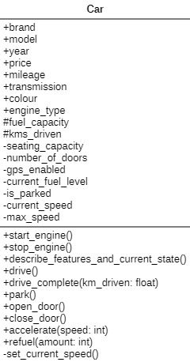

# Day 1: Introduction to OOP Basics
## Topics:
- Object-Oriented Programming overview
- Key OOP concepts: 
    - Class 
    - Object 
    - Encapsulation 
    - Abstraction 
    - Inheritance 
    - Polymorphism
- Introduction to OOMD: What is modeling and its importance?

## Activities:
- Write code implementing the Car class and its attributes/methods.
- Create a UML class diagram for a Car class.

## UML Class Diagram for Car class.

