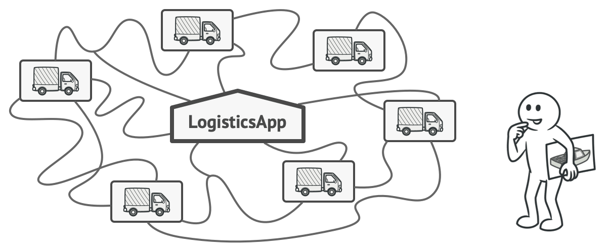
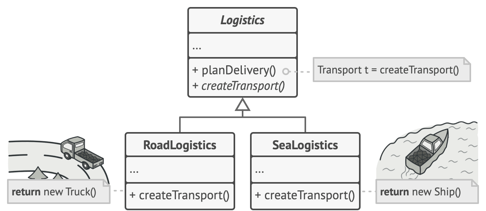
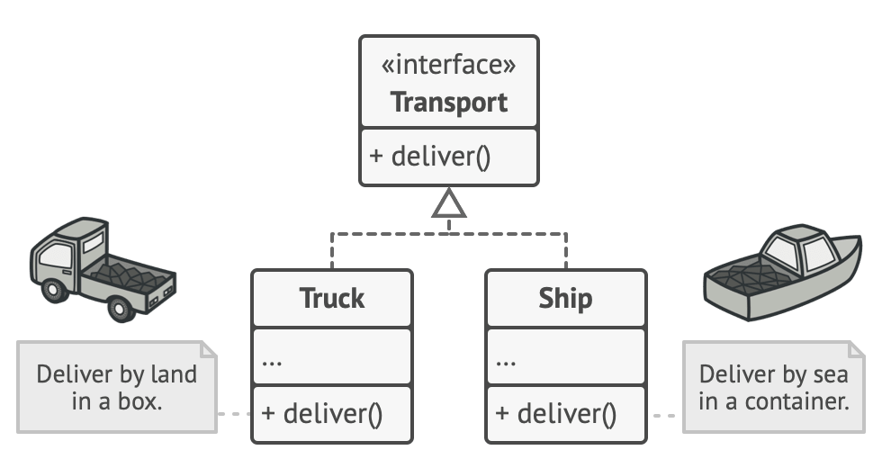
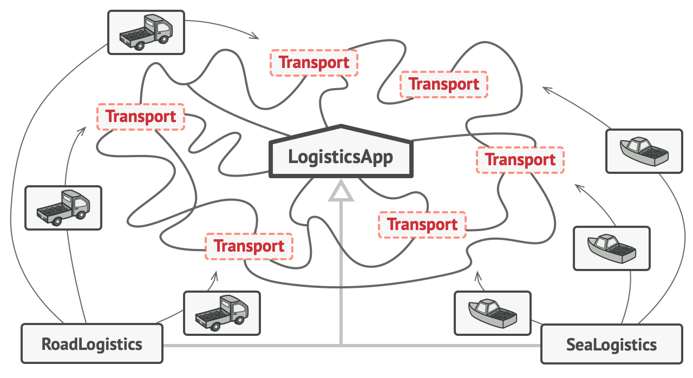
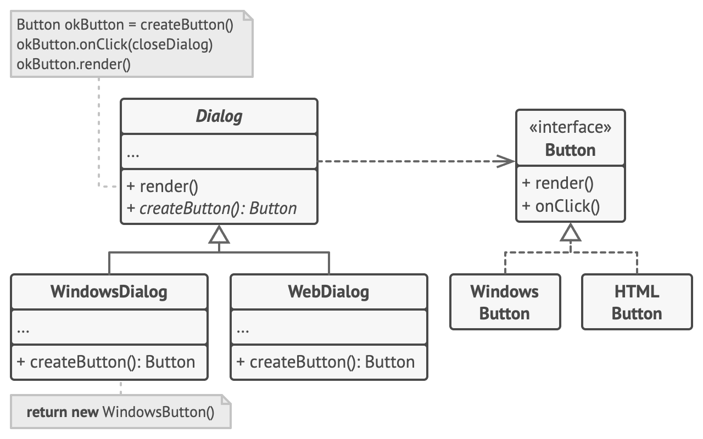

# Factory Method

## Intent
Factory Method is a creational design pattern that provides an interface for creating objects in a superclass, but allows subclasses to alter the type of objects that will be created.


## Problem
Imagine that you’re creating a logistics management application. The first version of your app can only handle transportation by trucks, so the bulk of your code lives inside the Truck class.

After a while, your app becomes pretty popular. Each day you receive dozens of requests from sea transportation companies to incorporate sea logistics into the app.

|  | 
|:--:|  
| *Adding a new class to the program isn’t that simple if the rest of the code is already coupled to existing classes.* |
||

Great news, right? But how about the code? At present, most of your code is coupled to the Truck class. Adding Ships into the app would require making changes to the entire codebase. Moreover, if later you decide to add another type of transportation to the app, you will probably need to make all of these changes again.

As a result, you will end up with pretty nasty code, riddled with conditionals that switch the app’s behavior depending on the class of transportation objects.


## Solution
The Factory Method pattern suggests that you replace direct object construction calls (using the new operator) with calls to a special factory method. Don’t worry: the objects are still created via the new operator, but it’s being called from within the factory method. Objects returned by a factory method are often referred to as products.

|  |
|:--:|  
| Subclasses can alter the class of objects being returned by the factory method. |

At first glance, this change may look pointless: we just moved the constructor call from one part of the program to another. However, consider this: now you can override the factory method in a subclass and change the class of products being created by the method.

There’s a slight limitation though: subclasses may return different types of products only if these products have a common base class or interface. Also, the factory method in the base class should have its return type declared as this interface.


||
|:--:|
|All products must follow the same interface.|

For example, both Truck and Ship classes should implement the Transport interface, which declares a method called deliver. Each class implements this method differently: trucks deliver cargo by land, ships deliver cargo by sea. The factory method in the RoadLogistics class returns truck objects, whereas the factory method in the SeaLogistics class returns ships.


|:--:|
|As long as all product classes implement a common interface, you can pass their objects to the client code without breaking it.|

The code that uses the factory method (often called the client code) doesn’t see a difference between the actual products returned by various subclasses. The client treats all the products as abstract Transport. The client knows that all transport objects are supposed to have the deliver method, but exactly how it works isn’t important to the client.

## Structure
- The Product declares the interface, which is common to all objects that can be produced by the creator and its subclasses.

- Concrete Products are different implementations of the product interface.

- The Creator class declares the factory method that returns new product objects. It’s important that the return type of this method matches the product interface.
<br>You can declare the factory method as abstract to force all subclasses to implement their own versions of the method. As an alternative, the base factory method can return some default product type.

- Concrete Creators override the base factory method so it returns a different type of product.<br>**Note that the factory method doesn’t have to create new instances all the time. It can also return existing objects from a cache, an object pool, or another source.**

## Pseudocode
This example illustrates how the Factory Method can be used for creating cross-platform UI elements without coupling the client code to concrete UI classes.



The structure of the Factory Method pattern example
The cross-platform dialog example.

The base Dialog class uses different UI elements to render its window. Under various operating systems, these elements may look a little bit different, but they should still behave consistently. A button in Windows is still a button in Linux.

When the factory method comes into play, you don’t need to rewrite the logic of the Dialog class for each operating system. If we declare a factory method that produces buttons inside the base Dialog class, we can later create a subclass that returns Windows-styled buttons from the factory method. The subclass then inherits most of the code from the base class, but, thanks to the factory method, can render Windows-looking buttons on the screen.

For this pattern to work, the base Dialog class must work with abstract buttons: a base class or an interface that all concrete buttons follow. This way the code within Dialog remains functional, whichever type of buttons it works with.

Of course, you can apply this approach to other UI elements as well. However, with each new factory method you add to the Dialog, you get closer to the Abstract Factory pattern. Fear not, we’ll talk about this pattern later.

```
// The creator class declares the factory method that must
// return an object of a product class. The creator's subclasses
// usually provide the implementation of this method.
class Dialog is
    // The creator may also provide some default implementation
    // of the factory method.
    abstract method createButton():Button

    // Note that, despite its name, the creator's primary
    // responsibility isn't creating products. It usually
    // contains some core business logic that relies on product
    // objects returned by the factory method. Subclasses can
    // indirectly change that business logic by overriding the
    // factory method and returning a different type of product
    // from it.
    method render() is
        // Call the factory method to create a product object.
        Button okButton = createButton()
        // Now use the product.
        okButton.onClick(closeDialog)
        okButton.render()


// Concrete creators override the factory method to change the
// resulting product's type.
class WindowsDialog extends Dialog is
    method createButton():Button is
        return new WindowsButton()

class WebDialog extends Dialog is
    method createButton():Button is
        return new HTMLButton()


// The product interface declares the operations that all
// concrete products must implement.
interface Button is
    method render()
    method onClick(f)

// Concrete products provide various implementations of the
// product interface.
class WindowsButton implements Button is
    method render(a, b) is
        // Render a button in Windows style.
    method onClick(f) is
        // Bind a native OS click event.

class HTMLButton implements Button is
    method render(a, b) is
        // Return an HTML representation of a button.
    method onClick(f) is
        // Bind a web browser click event.


class Application is
    field dialog: Dialog

    // The application picks a creator's type depending on the
    // current configuration or environment settings.
    method initialize() is
        config = readApplicationConfigFile()

        if (config.OS == "Windows") then
            dialog = new WindowsDialog()
        else if (config.OS == "Web") then
            dialog = new WebDialog()
        else
            throw new Exception("Error! Unknown operating system.")

    // The client code works with an instance of a concrete
    // creator, albeit through its base interface. As long as
    // the client keeps working with the creator via the base
    // interface, you can pass it any creator's subclass.
    method main() is
        this.initialize()
        dialog.render()
```

## Applicability
- Use the Factory Method when you don’t know beforehand the exact types and dependencies of the objects your code should work with.

- The Factory Method separates product construction code from the code that actually uses the product. Therefore it’s easier to extend the product construction code independently from the rest of the code.
<br>For example, to add a new product type to the app, you’ll only need to create a new creator subclass and override the factory method in it.

- Use the Factory Method when you want to provide users of your library or framework with a way to extend its internal components.

- Inheritance is probably the easiest way to extend the default behavior of a library or framework. But how would the framework recognize that your subclass should be used instead of a standard component?
<br>The solution is to reduce the code that constructs components across the framework into a single factory method and let anyone override this method in addition to extending the component itself.
<br>Let’s see how that would work. Imagine that you write an app using an open source UI framework. Your app should have round buttons, but the framework only provides square ones. You extend the standard Button class with a glorious RoundButton subclass. But now you need to tell the main UIFramework class to use the new button subclass instead of a default one.
<br>To achieve this, you create a subclass UIWithRoundButtons from a base framework class and override its createButton method. While this method returns Button objects in the base class, you make your subclass return RoundButton objects. Now use the UIWithRoundButtons class instead of UIFramework. And that’s about it!

- Use the Factory Method when you want to save system resources by reusing existing objects instead of rebuilding them each time.

- You often experience this need when dealing with large, resource-intensive objects such as database connections, file systems, and network resources.
<br>Let’s think about what has to be done to reuse an existing object:
    - First, you need to create some storage to keep track of all of the created objects.
    - When someone requests an object, the program should look for a free object inside that pool.
    - … and then return it to the client code.
    - If there are no free objects, the program should create a new one (and add it to the pool).
    
    That’s a lot of code! And it must all be put into a single place so that you don’t pollute the program with duplicate code.
    
    Probably the most obvious and convenient place where this code could be placed is the constructor of the class whose objects we’re trying to reuse. However, a constructor must always return new objects by definition. It can’t return existing instances.
    
    Therefore, you need to have a regular method capable of creating new objects as well as reusing existing ones. That sounds very much like a factory method.


## When to Use the Factory Method Design Pattern
Below is when to use factory method design pattern:

- If your object creation process is complex or varies under different conditions, using a factory method can make your client code simpler and promote reusability.
- The Factory Method Pattern allows you to create objects through an interface or abstract class, hiding the details of concrete implementations. This reduces dependencies and makes it easier to modify or expand the system without affecting existing code.
- If your application needs to create different versions of a product or may introduce new types in the future, the Factory Method Pattern provides a flexible way to handle these variations by defining specific factory methods for each product type.
- Factories can also encapsulate configuration logic, allowing clients to customize the object creation process by providing parameters or options to the factory method.

## Components of Factory Method Design Pattern
Below are the main components of Factory Design Pattern:

- **Creator**: This is an abstract class or an interface that declares the factory method. The creator typically contains a method that serves as a factory for creating objects. It may also contain other methods that work with the created objects.
- **Concrete Creator**: Concrete Creator classes are subclasses of the Creator that implement the factory method to create specific types of objects. Each Concrete Creator is responsible for creating a particular product.
- **Product**: This is the interface or abstract class for the objects that the factory method creates. The Product defines the common interface for all objects that the factory method can create.
- **Concrete Product**: Concrete Product classes are the actual objects that the factory method creates. Each Concrete Product class implements the Product interface or extends the Product abstract class.


## When to Use the Factory Method Pattern?
- You want flexibility in creating objects but don't want to expose the instantiation logic.
- The code requires different object types based on certain conditions or inputs.
- You want to enforce a common interface across related object types.
- Avoid tight coupling between the client code and specific classes.
